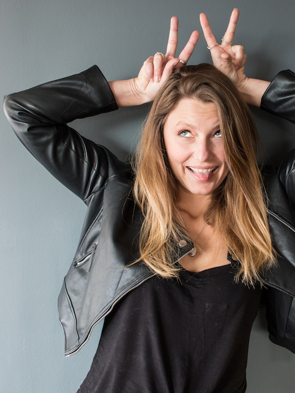
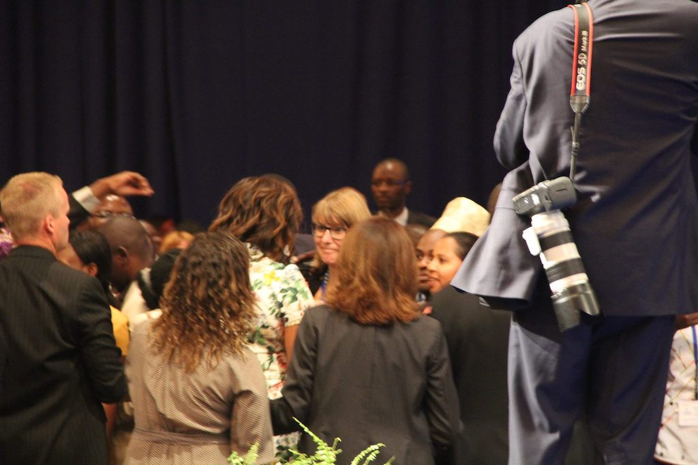

# Meet Sam Beckbessinger

Hi. I'm Sam. I'm a writer, UX researcher and fintech entrepreneur who’s spent most of the past ten years building tools to help people manage their money better. I also write fiction (mostly weird horror stuff featuring too many bodily fluids). I live in Cape Town, South Africa, with my stupid cat Sir Digby Chicken Caesar.

I don’t have a background in finance; I have a background in talking to people and trying to make stuff easier for them. I’m obsessed with making money management simpler, because finance bros like to make it all sound a lot more complicated than it is. Not having a background in finance helps, because my approach is a lot more human-centred. I don’t have any patience for the nonsense jargon or questionable money-making tactics that infects so much of the industry.

Me and two of my besties run a company called [Phantom Design](http://phantom.design/), a fintech product development company that has helped to build bitcoin wallets, cryptocurrency exchanges, smart credit cards and more.

Before that, I was a product manager at 22Seven, where I launched a ‘nudge engine’ that uses artificial intelligence to help people manage their money, and ran hardcore qualitative research projects to understand customer mental models around spending and saving. I had far more fun doing all of this than should be legal.

In various previous lives I've been a lecturer, a games developer, a marketing strategist, an NGO founder, and the world's most clumsy waitress. I have a BA from the University of Cape Town and was a 2014 Mandela Washington Fellow at Yale University, where I got to high-five Barack Obama (true story). Here's a photo of my hugging Michelle, if you don't believe me. That is my "oh-my-god-this-is-the-best-moment-of-my-life-I'm-about-to-cry" face.

*How to Manage Money Like a F*cking Grownup* is my second book. The first one was a children's book about a dancing hippo, though, so it was pretty unrelated.

The last thing you should know about me: I have a potty mouth. Don’t blame me, blame my mother - who swears like a sailor.

**VERY IMPORTANT THING TO NOTE: I am not a certified financial advisor. I want to help you understand some money basics, and show you a path to sorting your financial life out. If your situation is complicated, [get some professional help]({{ site.baseurl }}).**

Need a more profesh or press-friendly bio? <a href="/downloads/Formal Biography - Sam Beckbessinger.pdf" download>Download that here.</a>

----------------

Listen to me rant about *Buffy the Vampire Slayer* on Twitter: [@beckbessinger](https://twitter.com/beckbessinger)

Check out all the photos of my dumb cat on Instagram: [@greenham_sam](https://www.instagram.com/greenham_sam/)
