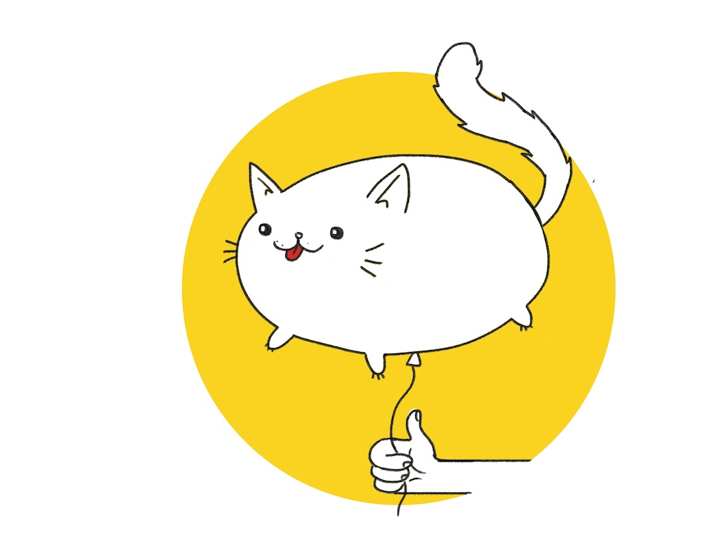

# Howzit. Heita. Welcome.

I’ve spent most of the past decade trying to build better tools for interacting with money. I didn’t do this because I find money particularly interesting. Money, as you’ll see, is actually pretty basic. What I find fascinating is humans, and the choices they make about what kinds of lives to live, and the stories we tell each other about how the world works.

This has involved countless hours interviewing people about what they want from money, from South Africa to Kenya, Uganda to the UK, Zimbabwe to the US. People have told me their money plans, their hopes and dreams, their fears and their feels.

Do you know what I learnt? The stories we’re told about money are mostly bullshit.

We never get an instruction manual about how money works. We never have to pass a test to get our Money Licence before we can take a new credit card for a drive. Most of what we learn about money comes from advertising or from other people who know as little as we do. No wonder we make such basic mistakes. No wonder we feel disempowered and scared. No wonder so many of us just decide to stick our heads in the damn sand and never deal with it.

I decided to write this book, and start this movement, because so many of the people I spoke to told me that they wished someone would.

## My mission
Money is about a lot more than money. It’s about your choices, and what kind of life you want to live. Being in control of your money means being an active steward of your own life.

In my early-20s, I had so many self-limiting narratives about money. I chose jobs I hated because I was terrified of being broke, and then I went and overspent and got into debt, to try to fill the hole of how miserable those jobs were making me, and so somehow I ended up poorer than I started when I took those supposedly lucrative jobs! Past-me was a dumbass.

Think about how much money you’re actually going to earn over the course of your lifetime. Really picture it. If you earn just R10 000 a month from age 25 to 65, getting just a 6% raise every year, that’s nearly R20-million. There’s a lot of big, audacious dreams you can turn into reality for R20-million. You have a lot more choices than you realise.

I want to help people take control of their spending, and put their money into the things they really care about, the things that matter to them. I want more people to live the lives they truly, fiercely want to live.

## Where should I start?
So, there's [a book]({{ site.baseurl }}) that you might want to buy, because it contains most of the really good stuff. This site is intended to be a companion to that book, so some stuff here might not make very much sense without it.

If you're not convinced yet that the book is for you (and I don't blame you for being skeptical, a lot of money books are very meh), [watch some of my videos]({{ site.baseurl }}) and see whether you dig my vibe.

Once you start reading the book, you'll probably want to download the [all-in-one money dashboard]({{ site.baseurl }}) so that you can start to get your shit together.

Keep yourself motivated by subscribing to our newsletter (on the homepage) and by joining our badass (and highly opinionated) Facebook community, [The League of Fucking Grownups](https://www.facebook.com/groups/leagueofgrownups/).

## Don't be shy
Tell me how I can help! Don't be shy to get in touch, ask questions, and tell me what you think I could do better. All of this helps me on my mission to help more young people find their freedom.

Welcome, you fiendishly good-looking reader. Take a look around.

Love
Sam

